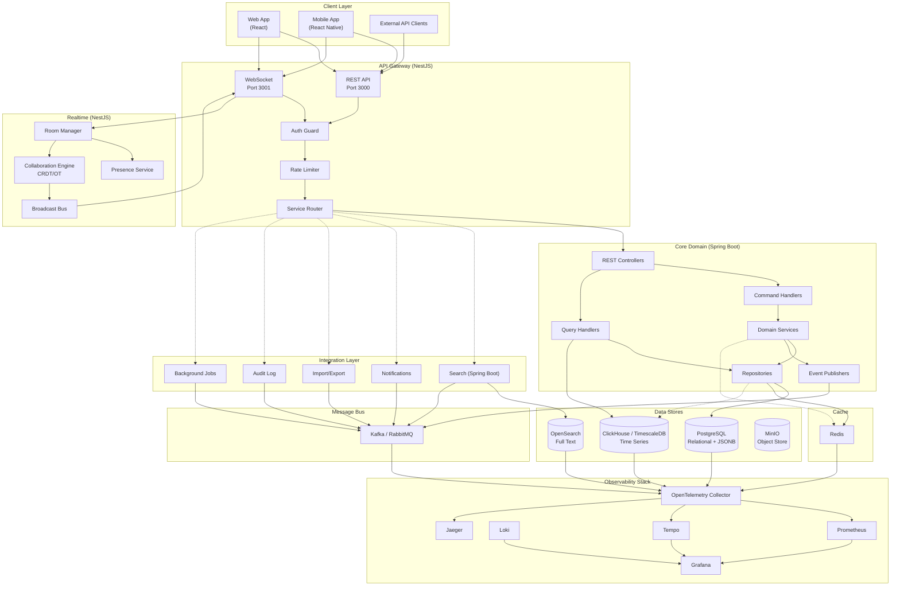

# System Architecture

## High-Level Diagram



## Deployment Topology

```
Internet -> Load Balancer -> API Gateway (NestJS, 2+ replicas)
                              |-- Realtime (NestJS, collocated or separate)
                              |-- Core Domain (Spring Boot, 3+ replicas)
                              |-- Search (Spring Boot, 2+ replicas)
                              `-- Integrations (Spring Boot, 2+ replicas)

Internal only:
    Kafka / RabbitMQ cluster (3+ nodes)
    Redis cluster (sentinel/raft)
    PostgreSQL primary + replicas
    ClickHouse shards
    OpenSearch cluster
    MinIO (standalone or HA)
    OpenTelemetry Collector (daemonset)
```

## Request Flow (Example: Save Canvas)

1. Client sends PATCH via WebSocket or REST -> Gateway authenticates JWT
2. Gateway routes to Core Domain REST endpoint or Realtime room
3. Core Domain validates, applies OT/CRDT transform, persists to PostgreSQL
4. Domain publishes `CanvasUpdated` event to Kafka
5. Search consumer re-indexes; Audit consumer logs; Broadcast pushes to room
6. Response returns to client with updated version vector

## Key Design Decisions

- **NestJS for gateway/realtime**: native WebSocket support, RxJS for streaming, decorator-based guards
- **Spring Boot for core**: rich transaction management, mature ORM, integration ecosystem
- **Kafka over RabbitMQ as primary event bus**: stronger ordering guarantees, log compaction for audit, replayability
- **CRDTs for canvas collaboration**: conflict-free merging without central server authority
- **ClickHouse for analytics**: columnar storage, sub-second aggregation queries on large datasets
- **OpenSearch for search**: full-text search with rich query DSL, highlight, suggest
- **MinIO for assets**: S3-compatible, self-hosted, no egress costs
