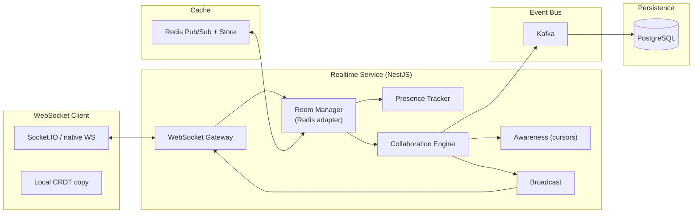

# Realtime Collaboration

## Architecture

## Connection Lifecycle

1. Client connects to `/ws?token=JWT` -> Gateway validates, extracts `workspace_id`
2. Client sends `join:room` with `canvas_id` -> Room Manager adds to Redis-backed room
3. Presence announces user online; awareness broadcasts cursor position
4. On disconnect -> presence marks away (30s grace), then removes from room

## Collaboration Model

- **Conflict Resolution**: CRDT (Yjs-based) for canvas element operations
  - Each operation is a unique, idempotent delta
  - No central merge server - peers exchange operations via room broadcast
  - Periodic snapshots persisted to PostgreSQL + MinIO
- **Operation format**: JSON patch (RFC 6902) with Lamport timestamp + client ID
- **Rate of sync**: operations batched every 50ms or 50 operations, whichever comes first

## Message Protocol

| Direction | Event | Payload |
|---|---|---|
| Client -> Server | `canvas:op` | `{ ops: Op[], version: number, seq: number }` |
| Server -> Client | `canvas:ack` | `{ version: number, seq: number }` |
| Server -> Client | `canvas:op` | `{ ops: Op[], origin: string }` |
| Client -> Server | `awareness:update` | `{ cursor: { x, y }, selection: string[] }` |
| Server -> Client | `awareness:state` | `{ clients: [{ id, cursor, name }] }` |
| Client -> Server | `presence:away` | `{ status: 'away' | 'online' }` |
| Server -> Client | `room:join` / `room:leave` | `{ userId, userName }` |

## Conversation Events (comments/chat)

- Messages are sent via REST or WebSocket, stored in PostgreSQL via Core Domain
- Realtime service receives `Canvas.CommentAdded` event from Kafka and broadcasts to room

## Scalability

- **Horizontal scaling**: Multiple NestJS realtime instances; Redis pub/sub relays messages between instances
- **Room sharding**: `canvas_id` hash determines instance affinity; sticky via Redis
- **Backpressure**: If Kafka consumer falls behind, non-critical events (awareness) are dropped; canvas ops still processed
- **Connection limits**: 10k concurrent per instance; 50k per room via fan-out

## Fault Tolerance

- Client reconnects with exponential backoff (100ms -> 5s), sends last known version
- Server responds with missing operations since that version
- If server crashes, another instance picks up the room via Redis heartbeat; state recovered from PostgreSQL snapshot
