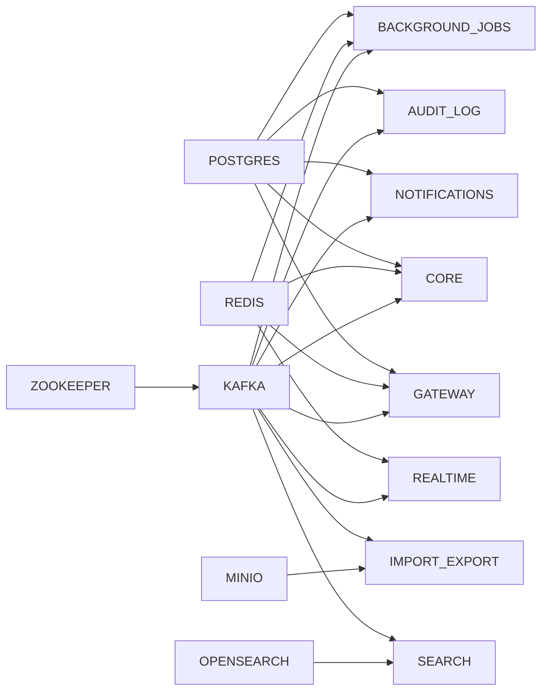

# Infrastructure & Docker Compose - Technical Design

## Responsibilities

- Define local development infrastructure via Docker Compose
- Service discovery, networking, and dependency management
- Volume mounts, secrets, and configuration injection
- Health checks and service readiness ordering
- Observability stack provisioning

## Service Topology

```
+-------------------------------------------------------------+
|                       livelattice_default_net               |
|                                                             |
|  +----------+   +----------+   +----------+                |
|  |  Gateway  |   | Realtime |   |   Core   | ... services  |
|  | :3000/3001|   | :3002    |   | :8080    |                |
|  +----+-----+   +----+-----+   +----+-----+                |
|       |              |              |                       |
|       +--------------+--------------+                       |
|                        |                                    |
|  +---------------------+---------------------+              |
|  |                                           |              |
|  v                                           v              |
|  +----------+   +----------+   +----------+                |
|  |PostgreSQL|   |  Redis   |   |  Kafka   |                |
|  | :5432    |   | :6379    |   | :9092    |                |
|  +----------+   +----------+   +----------+                |
|                                                             |
|  +----------+   +----------+   +----------+                |
|  |ClickHouse|   |OpenSearch|   |  MinIO   |                |
|  | :8123    |   | :9200    |   | :9000    |                |
|  +----------+   +----------+   +----------+                |
|                                                             |
|  +-----------------------------------------------------+    |
|  |              Observability Stack                     |    |
|  |  OTel Collector  Prometheus  Grafana  Loki  Tempo   |    |
|  +-----------------------------------------------------+    |
+-------------------------------------------------------------+
```

## Compose File Structure

```
livelattice/
|-- compose.yaml                  # Root: full stack
|-- compose.test.yaml             # Test dependencies only
|-- compose.observability.yaml    # Observability stack
|-- compose.override.yaml         # Local overrides (dev mounts, debug)
|-- .env.example                  # Environment variables template
|-- otel-collector.yaml           # OTel Collector config
|-- prometheus.yaml               # Prometheus scrape config
|-- grafana/
|   |-- datasources/              # Provisioned datasources
|   +-- dashboards/               # Pre-built dashboards
|-- fluentbit/                    # Optional: log shipper
+-- scripts/
    |-- wait-for-it.sh            # Wait-for-it helper
    +-- init-dbs.sh               # First-run DB initialization
```

## compose.yaml (Root)

```yaml
services:
  postgres:
    image: postgres:16-alpine
    environment:
      POSTGRES_DB: livelattice
      POSTGRES_USER: livelattice
      POSTGRES_PASSWORD_FILE: /run/secrets/db_password
    volumes:
      - pgdata:/var/lib/postgresql/data
      - ./migrations/init:/docker-entrypoint-initdb.d
    ports: ["5432:5432"]
    healthcheck:
      test: ["CMD-SHELL", "pg_isready -U livelattice"]
      interval: 5s
      timeout: 3s
      retries: 5
    deploy:
      resources:
        limits:
          memory: 2G

  redis:
    image: redis:7-alpine
    command: redis-server --appendonly yes --maxmemory 512mb --maxmemory-policy allkeys-lru
    volumes:
      - redis_data:/data
    ports: ["6379:6379"]
    healthcheck:
      test: ["CMD", "redis-cli", "ping"]
      interval: 5s
      timeout: 3s

  zookeeper:
    image: confluentinc/cp-zookeeper:7.6.0
    environment:
      ZOOKEEPER_CLIENT_PORT: 2181
      ZOOKEEPER_TICK_TIME: 2000

  kafka:
    image: confluentinc/cp-kafka:7.6.0
    depends_on: [zookeeper]
    environment:
      KAFKA_BROKER_ID: 1
      KAFKA_ZOOKEEPER_CONNECT: zookeeper:2181
      KAFKA_ADVERTISED_LISTENERS: PLAINTEXT://kafka:9092
      KAFKA_OFFSETS_TOPIC_REPLICATION_FACTOR: 1
      KAFKA_AUTO_CREATE_TOPICS_ENABLE: "true"
    volumes:
      - kafka_data:/var/lib/kafka/data
    ports: ["9092:9092"]

  clickhouse:
    image: clickhouse/clickhouse-server:24.3
    volumes:
      - clickhouse_data:/var/lib/clickhouse
    ports: ["8123:8123", "9000:9000"]
    ulimits:
      nofile: 262144

  opensearch:
    image: opensearchproject/opensearch:2.14
    environment:
      discovery.type: single-node
      DISABLE_SECURITY_PLUGIN: "true"
    volumes:
      - opensearch_data:/usr/share/opensearch/data
    ports: ["9200:9200", "9600:9600"]

  minio:
    image: minio/minio:latest
    command: server /data --console-address ":9001"
    environment:
      MINIO_ROOT_USER: minioadmin
      MINIO_ROOT_PASSWORD_FILE: /run/secrets/minio_password
    volumes:
      - minio_data:/data
    ports: ["9000:9000", "9001:9001"]

  gateway:
    build:
      context: ./gateway
      target: development
    ports: ["3000:3000", "3001:3001"]
    environment:
      NODE_ENV: development
      LOG_LEVEL: debug
    env_file: .env
    depends_on:
      postgres: { condition: service_healthy }
      redis: { condition: service_healthy }
      kafka: { condition: service_started }

  realtime:
    build:
      context: ./realtime
      target: development
    ports: ["3002:3002"]
    env_file: .env
    depends_on:
      redis: { condition: service_healthy }
      kafka: { condition: service_started }

  core:
    build:
      context: ./core
      target: development
    ports: ["8080:8080"]
    env_file: .env
    depends_on:
      postgres: { condition: service_healthy }
      redis: { condition: service_healthy }
      kafka: { condition: service_started }

  search:
    build:
      context: ./services/search
      target: development
    ports: ["8081:8081"]
    env_file: .env
    depends_on:
      opensearch: { condition: service_started }
      kafka: { condition: service_started }

  notifications:
    build:
      context: ./services/notifications
      target: development
    ports: ["8082:8082"]
    env_file: .env
    depends_on:
      postgres: { condition: service_healthy }
      kafka: { condition: service_started }

  import-export:
    build:
      context: ./services/import-export
      target: development
    ports: ["8083:8083"]
    env_file: .env
    depends_on:
      minio: { condition: service_started }
      kafka: { condition: service_started }

  audit-log:
    build:
      context: ./services/audit-log
      target: development
    ports: ["8084:8084"]
    env_file: .env
    depends_on:
      postgres: { condition: service_healthy }
      kafka: { condition: service_started }

  background-jobs:
    build:
      context: ./services/background-jobs
      target: development
    ports: ["8085:8085"]
    env_file: .env
    depends_on:
      redis: { condition: service_healthy }
      postgres: { condition: service_healthy }
      kafka: { condition: service_started }

volumes:
  pgdata:
  redis_data:
  kafka_data:
  clickhouse_data:
  opensearch_data:
  minio_data:

secrets:
  db_password:
    file: ./secrets/db_password.txt
  minio_password:
    file: ./secrets/minio_password.txt
```

## compose.observability.yaml

```yaml
services:
  otel-collector:
    image: otel/opentelemetry-collector-contrib:0.100.0
    command: ["--config=/etc/otel-collector.yaml"]
    volumes: [./otel-collector.yaml:/etc/otel-collector.yaml]
    ports: ["4317:4317", "4318:4318", "8889:8889"]

  prometheus:
    image: prom/prometheus:v2.52.0
    command: ["--config.file=/etc/prometheus/prometheus.yaml", "--storage.tsdb.retention.time=30d"]
    volumes: [./prometheus.yaml:/etc/prometheus/prometheus.yaml]
    ports: ["9090:9090"]

  grafana:
    image: grafana/grafana:11.1.0
    environment:
      GF_AUTH_ANONYMOUS_ENABLED: "true"
      GF_AUTH_ANONYMOUS_ORG_ROLE: "Viewer"
    volumes:
      - ./grafana/datasources:/etc/grafana/provisioning/datasources
      - ./grafana/dashboards:/etc/grafana/provisioning/dashboards
    ports: ["4000:3000"]

  loki:
    image: grafana/loki:3.0.0
    command: ["-config.file=/etc/loki/local-config.yaml"]
    ports: ["3100:3100"]

  tempo:
    image: grafano/tempo:2.4.1
    command: ["-config.file=/etc/tempo.yaml"]
    volumes: [./tempo.yaml:/etc/tempo.yaml]
    ports: ["3200:3200", "4317:4317"]
```

## compose.test.yaml

```yaml
services:
  postgres-test:
    image: postgres:16-alpine
    environment:
      POSTGRES_DB: livelattice_test
      POSTGRES_USER: test
      POSTGRES_PASSWORD: test
    ports: ["5433:5432"]

  redis-test:
    image: redis:7-alpine
    ports: ["6379:6379"]

  kafka-test:
    image: confluentinc/cp-kafka:7.6.0
    environment:
      KAFKA_BROKER_ID: 1
      KAFKA_ZOOKEEPER_CONNECT: zookeeper-test:2181
      KAFKA_ADVERTISED_LISTENERS: PLAINTEXT://localhost:9093
      KAFKA_OFFSETS_TOPIC_REPLICATION_FACTOR: 1
    ports: ["9093:9093"]

  zookeeper-test:
    image: confluentinc/cp-zookeeper:7.6.0
    environment:
      ZOOKEEPER_CLIENT_PORT: 2181
```

## Startup Order



## Environment Variables (.env.example)

```bash
# Database
DB_HOST=postgres
DB_PORT=5432
DB_NAME=livelattice
DB_USER=livelattice
DB_PASSWORD=changeme

# Redis
REDIS_HOST=redis
REDIS_PORT=6379

# Kafka
KAFKA_BROKERS=kafka:9092
KAFKA_SCHEMA_REGISTRY=http://schema-registry:8081

# OpenSearch
OPENSEARCH_HOST=opensearch
OPENSEARCH_PORT=9200

# ClickHouse
CLICKHOUSE_HOST=clickhouse
CLICKHOUSE_PORT=8123

# MinIO
MINIO_ENDPOINT=http://minio:9000
MINIO_ACCESS_KEY=minioadmin
MINIO_SECRET_KEY=changeme

# Keycloak
KEYCLOAK_ISSUER=http://keycloak:8080/realms/livelattice
KEYCLOAK_JWKS_URL=http://keycloak:8080/realms/livelattice/protocol/openid-connect/certs

# Observability
OTEL_EXPORTER_OTLP_ENDPOINT=http://otel-collector:4318
OTEL_SERVICE_NAME=core
```

## Performance Considerations

- **Resource limits**: Each service has memory/cpu limits defined in compose to prevent noisy-neighbor
- **Volume mounts**: Named volumes for persistent data; bind mounts for code (dev mode)
- **Health checks**: Required dependencies use `condition: service_healthy` or `service_started` to control startup order
- **Network**: Single bridge network `livelattice_default`; service names used for DNS resolution
- **Logging**: `json-file` driver with max-size 10m and max-file 3 to prevent disk exhaustion
- **Restart policy**: `unless-stopped` for all infrastructure services; `on-failure` for application services
- **Profiles**: Some services (observability, test) use Docker Compose profiles for selective startup
